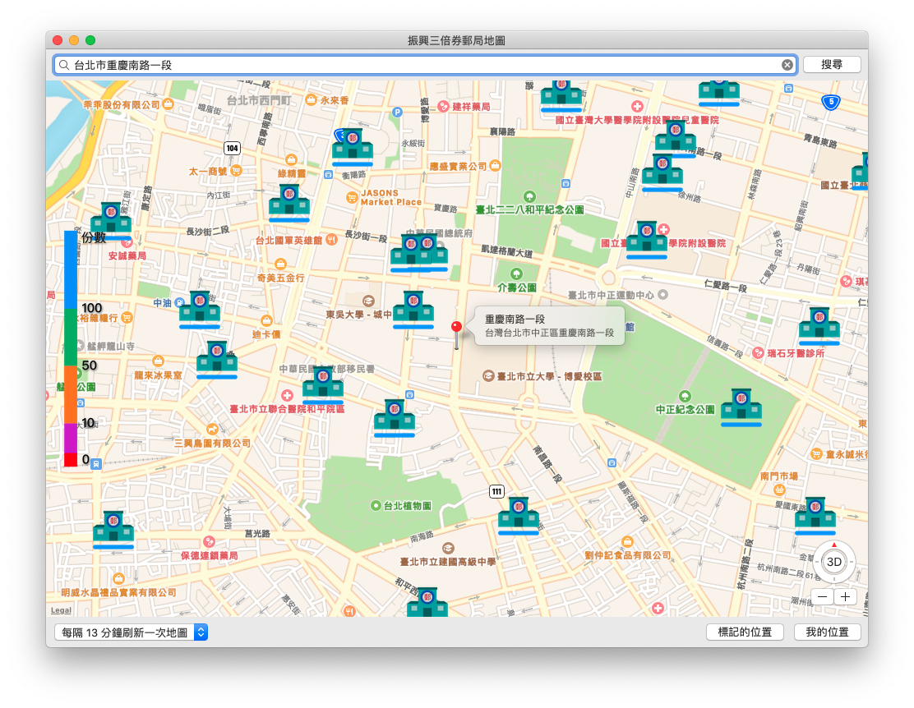
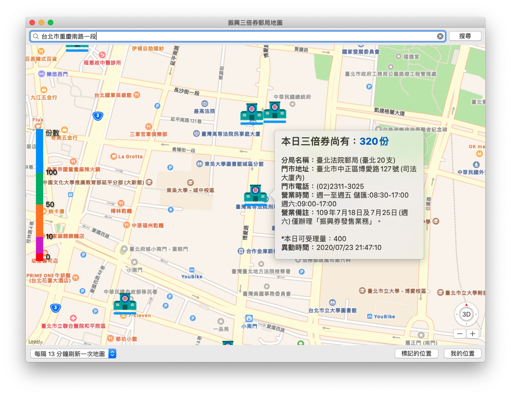

# 振興三倍券郵局地圖 🗺 - Mac 版本

## 說明

- 振興三倍券是台灣政府於 2020 年為了因應肺炎疫情造成的經濟緊縮，所發放的消費專用券。
- 本 App 的功能是顯示台灣郵局的三倍券即時領券量，資料集來源為 [https://data.gov.tw/dataset/127751](https://data.gov.tw/dataset/127751)
- 可用期限：2020/07/15 ~ 2020/12/31

## CC0 1.0 公眾領域貢獻宣告

本專案目錄下的程式碼，由作者 WL. 在法律許可的範圍內，拋棄該著作依著作權法所享有之權利，包括所有相關與鄰接的法律權利，並宣告將該著作貢獻至公眾領域。

- [https://creativecommons.org/publicdomain/zero/1.0/deed.zh_TW](https://creativecommons.org/publicdomain/zero/1.0/deed.zh_TW)

